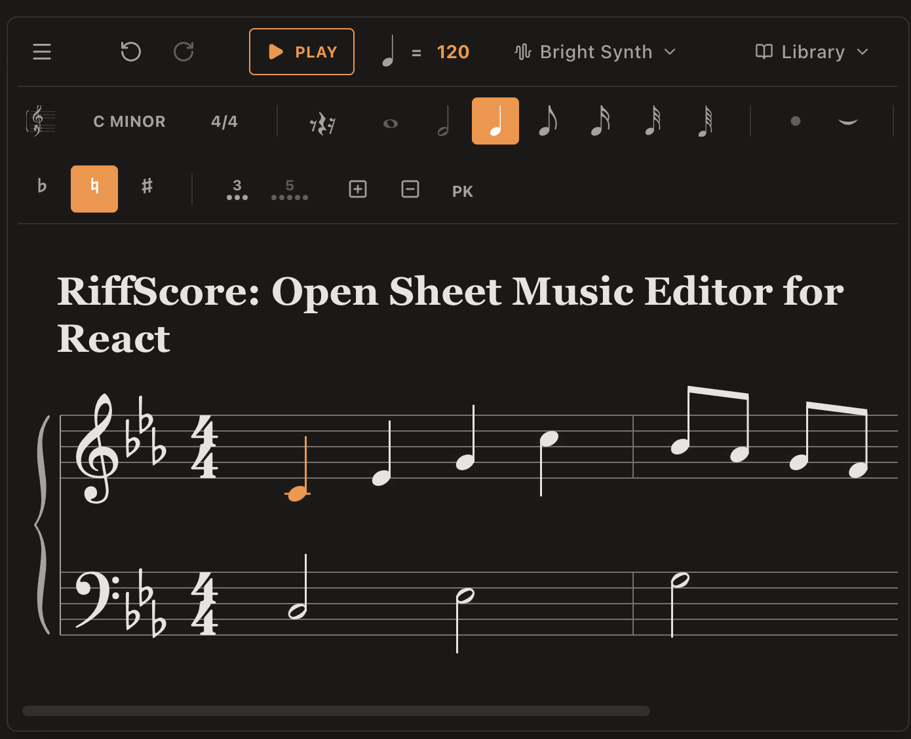

# RiffScore


**RiffScore** is a self-hostable, embeddable sheet music editor for React.

Unlike commercial platforms that require users to leave your site or pay subscription fees, RiffScore allows you to embed interactive, editable scores directly into your application.



## Installation

```bash
npm install riffscore
```

## Quick Start

```tsx
import { RiffScore } from 'riffscore';

function App() {
  return <RiffScore />;
}
```

That's it! RiffScore renders a fully interactive grand staff editor with sensible defaults.

### With Configuration

```tsx
<RiffScore config={{
  score: { 
    staff: 'treble',      // 'grand' | 'treble' | 'bass'
    measureCount: 4,
    keySignature: 'G'
  }
}} />
```

### Read-Only Mode

```tsx
<RiffScore config={{
  ui: { showToolbar: false },
  interaction: { isEnabled: false }
}} />
```

See the [Configuration Guide](./docs/CONFIGURATION.md) for all available options.

---

## Features

*   **Self-Hostable**: No external dependencies or platform lock-in.
*   **Embeddable**: Drop it into any React application.
*   **Configurable**: Full control over UI, interactions, and score content.
*   **SMuFL Compliance**: Beautiful engraving using the [Bravura](https://github.com/steinbergmedia/bravura) font.
*   **Interactive**: Full editing capabilities right in the browser.
*   **Music Engine**: Powered by [Tonal.js](https://github.com/tonaljs/tonal) for music theory logic and [Tone.js](https://tonejs.github.io/) for accurate browser-based playback.
*   **Export Options**: JSON, MusicXML, and ABC notation export.
*   **Theming**: Built-in dark, light, cool, and warm themes.
*   **MIDI Input**: Connect a MIDI keyboard for note entry.

---

## Keyboard Shortcuts

| Key | Action |
|-----|--------|
| `1`-`7` | Set note duration (64th to whole) |
| `R` | Toggle note/rest mode |
| `Space` | Play / Pause |
| `Cmd+Z` | Undo |
| `↑` / `↓` | Transpose selection |

See the [Interaction Guide](./docs/INTERACTION.md) for the complete keyboard reference.

---

## Documentation

| Guide | Description |
|-------|-------------|
| 📖 [Configuration](./docs/CONFIGURATION.md) | Complete API reference for config options |
| 📘 [Architecture](./docs/ARCHITECTURE.md) | Technical reference for developers |
| 🎨 [Interaction Design](./docs/INTERACTION.md) | Guide to the intuitive editing behavior |
| 🤝 [Contributing](./docs/CONTRIBUTING.md) | How to set up and contribute to the project |
| 📋 [Changelog](./CHANGELOG.md) | Release history |

---

## Repository Structure

```
riffscore/
├── src/        ← Library source
├── demo/       ← Next.js demo app
├── docs/       ← Documentation (architecture, configuration, etc.)
├── dist/       ← Built library (ESM/CJS/DTS)
└── tsup.config.ts
```

### Development

```bash
# Install dependencies
npm install
cd demo && npm install

# Build library
npm run build

# Run demo
npm run demo:dev
```

---

## Coming Soon

*   **Imperative API**: Programmatically control the score (e.g., `score.addNote(...)`)
*   **Chord Symbols**: Input and playback for lead sheets
*   **Import**: ABC and MusicXML import
