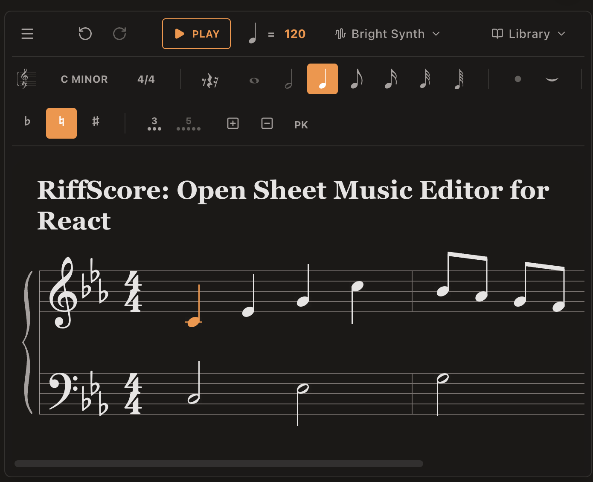

# RiffScore


**RiffScore** is a self-hostable, embeddable sheet music editor for React.

Unlike commercial platforms that require users to leave your site or pay subscription fees, RiffScore allows you to embed interactive, editable scores directly into your application.



## Installation

```bash
npm install riffscore
```

## Quick Start

```tsx
import { RiffScore } from 'riffscore';

function App() {
  return <RiffScore id="my-editor" />;
}
```

That's it! RiffScore renders a fully interactive grand staff editor with sensible defaults.

> **Note**: Styles and fonts are bundled automatically — no separate CSS import or font setup required.

### With Configuration

```tsx
<RiffScore id="my-editor" config={{
  score: { 
    staff: 'treble',      // 'grand' | 'treble' | 'bass' | 'alto' | 'tenor'
    measureCount: 4,
    keySignature: 'G'
  }
}} />
```

See [Configuration](./docs/CONFIGURATION.md) for all options.

### Read-Only Mode

```tsx
<RiffScore config={{
  ui: { showToolbar: false },
  interaction: { isEnabled: false }
}} />
```

See [Interaction Configuration](./docs/CONFIGURATION.md#interaction-configuration) for more display modes.

### Programmatic Control

```javascript
const api = window.riffScore.get('my-editor');

api.select(0)                      // Select first measure (0-indexed)
   .addNote('C4', 'quarter')       // Add a quarter note
   .addNote('E4')                  // Add with current duration
   .play();                        // Play from selection
```

> **Note**: All API indices are 0-based. Use `select(0)` for the first measure, `select(1)` for the second, etc.

See the [Cookbook](./docs/COOKBOOK.md) for more recipes.

---

## Features

### Core Editing
*   **Self-Hostable**: No external dependencies or platform lock-in.
*   **Embeddable**: Drop it into any React application.
*   **Configurable**: Full control over UI, interactions, and score content.
*   **SMuFL Compliance**: Beautiful engraving using the [Bravura](https://github.com/steinbergmedia/bravura) font.
*   **Export Options**: JSON, MusicXML, and ABC notation export.
*   **Theming**: Built-in dark, light, cool, and warm themes.

### Chord Symbols
*   **Click-to-Edit**: Click above any beat to add or edit chord symbols.
*   **Flexible Input**: Letter names (`Cmaj7`), solfège (`Do`), Roman numerals (`IV7`).
*   **Multiple Notations**: Display in letter, Roman numeral, Nashville number, or solfège.
*   **Playback**: Chord voicings play back alongside the score.
*   **Full API**: CRUD, selection, and navigation via `addChord()`, `selectChord()`, etc.

### Machine-Addressable API
*   **Imperative Control**: Programmatically control the score via `window.riffScore` ([API Reference](./docs/API.md))
*   **Fluent Chaining**: `api.select(1).addNote('C4').play()` — chainable methods for concise scripting.
*   **Event Subscriptions**: React to state changes with `api.on('score', callback)` and `api.on('batch', callback)`.
*   **Transaction Batching**: Atomic operations with `beginTransaction`/`commitTransaction` for single undo steps.
*   **Structured Feedback**: Unified `result` objects and sticky error states for robust scripting.
*   **Playback API**: `play()`, `pause()`, `stop()`, `rewind()`, `setInstrument()` for programmatic audio control.

### Engines
*   **Music Theory**: Powered by [Tonal.js](https://github.com/tonaljs/tonal) for scales, chords, and transposition.
*   **Audio Playback**: [Tone.js](https://tonejs.github.io/) sampler with multiple instrument support.
*   **MIDI Input**: Connect a MIDI keyboard for note entry (experimental).

---

## Keyboard Shortcuts

| Mac | Windows | Action |
|-----|---------|--------|
| **Entry & Editing** |||
| `1`-`7` | `1`-`7` | Set duration (64th to whole) |
| `.` | `.` | Toggle dotted |
| `R` | `R` | Toggle note/rest mode |
| `T` | `T` | Toggle tie |
| `Enter` | `Enter` | Insert note/rest at cursor |
| `↑` / `↓` | `↑` / `↓` | Transpose selection |
| **Navigation & Selection** |||
| `←` / `→` | `←` / `→` | Previous / Next event |
| `Shift+←/→` | `Shift+←/→` | Extend selection horizontally |
| `Cmd+↑/↓` | `Ctrl+↑/↓` | Navigate within chord |
| `Cmd+Shift+↑/↓` | `Ctrl+Shift+↑/↓` | Extend selection vertically |
| `Cmd+A` | `Ctrl+A` | Select all (progressive) |
| `Esc` | `Esc` | Clear selection / Cancel |
| **Playback** |||
| `Space` | `Space` | Play / Pause |
| **History** |||
| `Cmd+Z` | `Ctrl+Z` | Undo |
| `Cmd+Shift+Z` | `Ctrl+Y` | Redo |

See the [Interaction Guide](./docs/INTERACTION.md) for the complete keyboard reference.

---

## Documentation

> 📚 **[View Full Documentation Index](./docs/README.md)**  
> Browse all guides, architectural records, and migration history.


### Getting Started

| Guide | Description |
|-------|-------------|
| 📖 [Configuration](./docs/CONFIGURATION.md) | All config options for `<RiffScore />` |
| 🎹 [API Reference](./docs/API.md) | Imperative API for script control |
| 📗 [Cookbook](./docs/COOKBOOK.md) | Task-oriented recipes and examples |

### Deep Dives

| Guide | Description |
|-------|-------------|
| 🎨 [Interaction Design](./docs/INTERACTION.md) | UX philosophy and editor states |
| ⌨️ [Keyboard Navigation](./docs/KEYBOARD_NAVIGATION.md) | Navigation state machine details |
| 🎯 [Selection Model](./docs/SELECTION.md) | Multi-selection and vertical extension |

### Architecture

| Guide | Description |
|-------|-------------|
| 📘 [Architecture](./docs/ARCHITECTURE.md) | Technical overview and design principles |
| 🧩 [Coding Patterns](./docs/CODING_PATTERNS.md) | Common patterns and architectural standards |
| 🧱 [Data Model](./docs/DATA_MODEL.md) | Score schema and quant system |
| 🔧 [Commands](./docs/COMMANDS.md) | Command pattern reference |
| 🎼 [Layout Engine](./docs/LAYOUT_ENGINE.md) | Engraving and positioning |
| 📜 [ADRs](./docs/adr/) | Architecture Decision Records |

### Contributing

| Guide | Description |
|-------|-------------|
| 🤝 [Contributing](./docs/CONTRIBUTING.md) | Dev setup and guidelines |
| 🧪 [Testing](./docs/TESTING.md) | Test patterns and fixtures |
| 📋 [Changelog](./CHANGELOG.md) | Release history |

---

## Imperative API

Control the editor programmatically from external scripts:

```javascript
const api = window.riffScore.get('my-editor');

// Build a chord (indices are 0-based)
api.select(0)              // First measure
   .addNote('C4', 'quarter')
   .addNote('E4')
   .addNote('G4')
   .addTone('C5');          // Stack into chord

// Batch operations (single undo step)
api.beginTransaction();
for (let i = 0; i < 16; i++) {
  api.addNote(`C${(i % 3) + 4}`, 'sixteenth');
}
api.commitTransaction('Scale run');

// Subscribe to changes
api.on('batch', (e) => console.log(`Committed: ${e.label}`));
```

See the [API Reference](./docs/API.md) and [Cookbook](./docs/COOKBOOK.md) for all available methods.

---

## Repository Structure

```
riffscore/
├── src/        ← Library source
├── demo/       ← Next.js demo app
├── docs/       ← Documentation
├── dist/       ← Built library (ESM/CJS/DTS)
└── tsup.config.ts
```

### Development

```bash
# Install dependencies
npm install
cd demo && npm install

# Build library
npm run build

# Run demo
npm run demo:dev
```

---

## Coming Soon

*   **Page View & Print**: Multi-system rendering with automatic line breaks and print support ([#174](https://github.com/joekotvas/riffscore/issues/174))
*   **Import**: ABC and MusicXML import
*   **Clipboard API**: Copy, cut, and paste operations
*   **Move Operations**: Drag-and-drop and keyboard-based event moving
