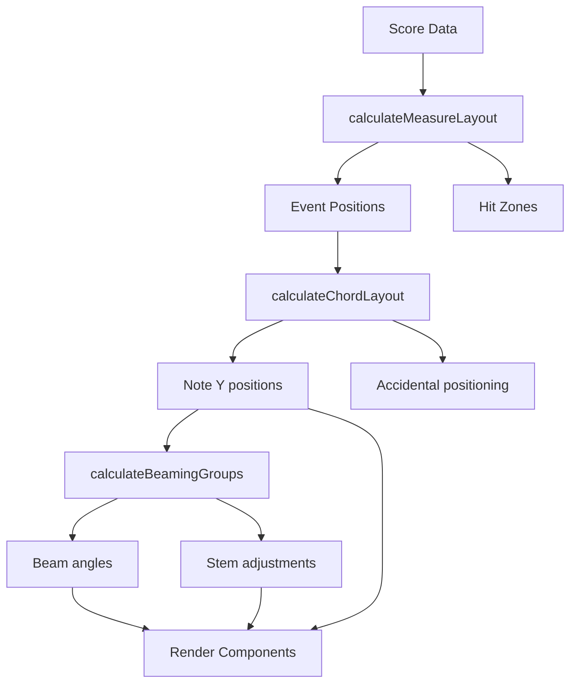

[← Back to README](../README.md) • [Architecture](./ARCHITECTURE.md)

# RiffScore Layout Engine

> Deep dive into the engraving and positioning system.

> **See also**: [Architecture](./ARCHITECTURE.md) • [Data Model](./DATA_MODEL.md) • [Coding Patterns](./CODING_PATTERNS.md)

---

## 1. Overview

The layout engine transforms **Score data** into **visual coordinates** for SVG rendering. It consists of modules in `src/engines/layout/`:

| Module | Purpose |
|--------|---------|
| `index.ts` | Re-exports all layout functions |
| `types.ts` | Layout type definitions (`ScoreLayout`, `YBounds`) |
| `scoreLayout.ts` | **Single source of truth** for all positions |
| `positioning.ts` | Pitch → Y coordinate mapping |
| `measure.ts` | Event positions, hit zones |
| `beaming.ts` | Beam groups and angles |
| `tuplets.ts` | Tuplet bracket positioning |
| `stems.ts` | Stem lengths and directions |
| `system.ts` | Multi-staff synchronization |
| `coordinateUtils.ts` | SVG coordinate utilities |

---

## 1.5 ScoreLayout: Single Source of Truth

The `scoreLayout.ts` module provides `calculateScoreLayout(score)`, which returns a `ScoreLayout` object containing all position data and accessor functions.

### ScoreLayout Interface

```typescript
interface ScoreLayout {
  staves: StaffLayout[];
  notes: Record<string, NoteLayout>;   // Note: NoteLayout.localX is measure-relative
  events: Record<string, EventLayout>; // Note: EventLayout.localX is measure-relative

  // X coordinate accessor (measure-relative)
  getX: {
    (params: { measure: number; quant: number }): number | null;  // Position within measure
    measureOrigin: (params: { measure: number }) => number | null; // Measure's absolute X
  };

  // Y coordinate accessors
  getY: {
    content: YBounds;                           // { top, bottom }
    system: (index: number) => YBounds | null;  // System bounds
    staff: (index: number) => YBounds | null;   // Staff bounds
    notes: (quant?: number) => YBounds;         // Note extent (collision)
    pitch: (pitch: string, staffIndex: number) => number | null;
  };
}
```

### Using getX for Horizontal Positioning (Measure-Relative)

The `getX` function returns **measure-relative** X coordinates. This design supports future system breaks where the same measure could appear at different absolute positions on different lines.

```typescript
// Get measure-relative X position for any position
const localX = layout.getX({ measure: 1, quant: 48 });  // X within measure 1

// Get measure's origin (absolute X)
const measureOrigin = layout.getX.measureOrigin({ measure: 1 });

// Compute absolute X when needed (e.g., for hit detection)
const absoluteX = (measureOrigin ?? 0) + (localX ?? 0);
```

**Rendering pattern for SVG:**
```tsx
<g transform={`translate(${layout.getX.measureOrigin({ measure }) ?? 0}, 0)`}>
  <Element x={layout.getX({ measure, quant }) ?? 0} />
</g>
```

> See [ADR-016: Measure-Relative X Positioning](./adr/016-measure-relative-x.md) for design rationale.

### Using getY for Vertical Positioning

```typescript
// Staff bounds (top line to bottom line)
const staffBounds = layout.getY.staff(0);  // { top: 80, bottom: 128 }

// System bounds (all staves combined)
const systemBounds = layout.getY.system(0);  // { top: 80, bottom: 248 }

// Note extent for collision avoidance
const noteExtent = layout.getY.notes();       // System-wide
const atQuant = layout.getY.notes(48);        // At specific beat

// Pitch positioning (clef-aware)
const y = layout.getY.pitch('C4', 0);  // Y for C4 on staff 0
```

### Forward-Flow Y Positioning

Y positions flow from top to bottom. Each element derives its position from elements above:

```
Y=0 (top of canvas)
  ↓
ChordTrack (above staves, avoiding notes)
  ↓
System 0
  ├── Staff 0 (treble)
  │     ↓ Notes (ledger lines up/down)
  ├── Staff 1 (bass)
  │     ↓ Notes
  ↓
Future: Lyrics, Dynamics, Pedaling (below staves)
```

> See [ADR-015: Forward-Flow Y Positioning](./adr/015-forward-flow-y-positioning.md) for design rationale.

---

## 2. Pitch to Y Coordinate

The `positioning.ts` module maps MIDI pitches to vertical positions using a **reference-based calculation**:

```
Y = referenceOffset + (refMidi - pitchMidi) * spacingFactor
```

Each clef defines a reference pitch and offset in `CLEF_REFERENCE`:

| Clef | Reference Pitch | Meaning |
|------|-----------------|---------|
| Treble | C4 at offset 60 | C4 on ledger line below |
| Bass | E2 at offset 60 | E2 on ledger line below |
| Alto | C4 at offset 24 | C4 on Line 3 (middle line) |
| Tenor | C4 at offset 18 | C4 on Line 4 |

> See [ADR-007: Open-Closed Clef Reference](./adr/007-open-closed-clef-reference.md) for the design rationale.

### Staff Lines

| Line | Treble | Bass | Alto | Tenor |
|------|--------|------|------|-------|
| 5th line | F5 | A3 | G4 | E4 |
| 4th line | D5 | F3 | E4 | C4 |
| 3rd line | B4 | D3 | C4 | A3 |
| 2nd line | G4 | B2 | A3 | F3 |
| 1st line | E4 | G2 | F3 | D3 |

---

## 3. Measure Layout

The `measure.ts` module calculates horizontal positioning:

### Quant System

- **64 quants** per whole note
- Quarter note = 16 quants
- Eighth note = 8 quants
- Sixteenth = 4 quants

### Horizontal Spacing

`getNoteWidth` (positioning.ts) gives each note the distance it claims before the next one:

```
width = NOTE_SPACING.UNIT * sqrt(quants)      // 11 px per √quant at 100%
width = max(width, NOTE_SPACING.MIN_WIDTH[duration])
width += dot padding when dotted
```

Each halving of the value takes about 1/√2 of the space, the classic engraving progression:
a whole ≈ 7.3 staff spaces, half ≈ 5.2, quarter ≈ 3.7, eighth ≈ 2.6, sixteenth ≈ 1.8, with
pixel floors for 32nds and 64ths. Calibrated so a 4/4 bar at the 60% page-view default (a
7.6 mm staff) matches engraved density: eight eighths ≈ 43 mm, four quarters ≈ 32 mm, sixteen
sixteenths ≈ 60 mm. `CONFIG.measurePaddingLeft` (2 spaces) sits between the barline and the
first note. Grand-staff synchronisation (`system.ts`) spaces each time segment by the same
table, so both staves agree. Glyph paddings (accidentals, dots, lookahead) are separate and
stay on `NOTE_SPACING_BASE_UNIT`. `noteSpacing.test.ts` pins these ranges.

### Hit Zones

Each rhythmic position has an invisible "hit zone" for click detection:

```
|-----|-----|-----|-----|  Hit zones
  q1    q2    q3    q4    Quarter beats
```

### Event Positioning

```typescript
calculateMeasureLayout(measure, config) → {
  eventPositions: Map<eventId, { x, width }>
  hitZones: Array<{ startQuant, endQuant, x, width }>
}
```

---

## 4. Beaming

The `beaming.ts` module groups notes for beaming and computes each group's geometry:

### Grouping Rules

1. Notes beam within one **beat** (`getBeamBeatQuants`): the denominator unit in simple
   meters (a quarter in 4/4, 3/4, 2/4; a half in 2/2), a dotted beat of three in compound
   meters (6/8, 9/8, 12/8); 3/8 beams the whole bar.
2. **4/4 only:** two complete quarter-beat groups of *plain* eighths on beats 1–2 or 3–4 join
   into one half-bar group of four. Nothing beams across the middle of the bar, and a beat
   containing a sixteenth, dotted or tuplet value keeps its beat-level group.
3. Rests and unbeamable durations break groups; a plain flagged value that overruns its beat
   is left unbeamed.
4. Mixed values inside a beat share one primary beam with secondary/partial segments (#245).

### Stem Direction (per group)

`beamGroupDirection`: the note **farthest from the middle line** decides — stems up when it
lies below, down when above. If the highest and lowest notes are equidistant, the **mean** of
every note in the group decides, and a mean on the line takes stems **down**. Chords contribute
all of their notes. This matches the single-note/chord rule in `positioning.ts`, so a beamed
group never flips direction against the unbeamed notes around it.

### Beam Slant

`beamRise` derives the beam's rise from the outer two anchors (top notes for up-stems, bottom
notes for down-stems), then applies the engraving limits:

- an inner note beyond **both** outer notes on the beam side ⇒ horizontal beam;
- the rise is capped by the interval between the outer anchors
  (`BEAMING.MAX_RISE_SPACES`: a second ¼ space, a third ½, a fourth ¾, a fifth or wider
  1 space);
- the rise/run never exceeds `BEAMING.MAX_SLOPE` (≈19°), so tightly spaced groups stay
  shallow.

The beam then sits the minimum beamed stem length (`STEM.BEAMED_LENGTHS`) from the note
nearest to it; every other stem is at least that long. Tuplet brackets over a beamed group
read their tips from the beam line, so they stay parallel to it.

---

## 4a. Vertical Layout (staff distance, lyric bands)

`vertical.ts` decides how far apart the staves of a system sit and what is reserved above and
below them. It is content-aware:

1. **Extent.** Every measure of every staff has a drawn extent relative to its staff's top line:
   noteheads and ledger notes (± half a space), stems (to the beam edge for beamed notes, a
   standard stem otherwise) and tuplet brackets with their numbers. Rests, accidentals and flags
   stay inside those bounds. `calculateMeasureExtents(score)` (scoreLayout.ts) returns them for
   the whole score from the same geometry the renderer draws.
2. **Lyric band.** `Staff.lyricLines` (default 0) reserves a band below that staff's extent —
   `lyricBandHeight(lines)` from `LYRICS` — and `lyricLineBaseline` says where each verse's
   baseline will sit (about 1.8 spaces below a bare staff, lower under ledger notes or beams).
   Lyrics themselves are not rendered yet (roadmap #30); the space is already accounted for.
3. **Offsets.** `calculateStaffOffsets` places each staff `CONFIG.staffSpacing` (120 px) below the
   previous one, or further when the previous staff's extent plus its band would come within
   `STAFF_DISTANCE.MIN_CLEARANCE` (one space) of this staff's extent. Staves that need no room
   never move.

Scroll view applies one vertical layout to the whole score (`ScoreLayout.vertical`,
`StaffLayout.y`). Page view applies it **per system**: `SystemLayout.staffOffsets` and `height`
follow that system's measures, and its `paddingTop`/`paddingBottom` grow past the ledger zones
when ink or a lyric band reaches further, so `distributeSystemsToPages` packs and justifies
per-system slot heights. `staffSpacing.test.tsx` and `e2e/bench/staff-spacing` pin the result.

---

## 4b. Ties

`Staff.renderTies` resolves every tie with `findTieTarget` (utils/ties.ts) — the single
definition of "the same-pitch note in the immediate next event", across barlines and system
breaks (split into an out-arc and an in-arc at the system edges). Endpoints come from the same
measure layout the noteheads use, including a justified system's stretch and its cross-staff
synchronized positions.

- **Curve side** (`tieCurveDirection`, ties.ts): away from the stem the note is drawn with — the
  beam's direction for a beamed note, the chord's otherwise; in a chord the outer ties curve
  outward and inner ties away from the chord's centre.
- **Continuations** (`collectTieStops`): a note that is a tie target carries its predecessor's
  accidental, so the accidental resolver draws no glyph for it (its alteration still enters the
  measure memory). The tie-stop set is threaded through both width engines and the renderer so
  reserved width and drawn glyphs never disagree.

---

## 5. Stem Direction

The `stems.ts` module determines stem direction:

### Single Notes

- Notes on or above middle line: stems **down**
- Notes below middle line: stems **up**

### Chords

- Direction follows the **extreme note** furthest from middle line
- If equidistant: stems **down**

### Stem Length

`unbeamedStemEnd` (stems.ts) is the one rule for unbeamed stems, read by the renderer, the
tuplet bracket and the vertical extents:

- Standard length `STEM.LENGTHS.default` (44 px ≈ 3.7 spaces) from the outer notehead in the
  stem's direction; longer for a third or fourth flag (`thirtysecond` 48, `sixtyfourth` 56) so
  the flag clears the head.
- **Never short of the middle line:** a note on the second ledger line or beyond has its stem
  extended to the middle line (Gould), so far-out notes get proportionally longer stems.
- Beamed stems end on their beam (`calculateStemGeometry` with a `beamSpec`); wide beamed groups
  may shorten the stems nearest the beam (see §4).

---

## 6. Tuplet Brackets

The `tuplets.ts` module positions tuplet brackets:

### Bracket Placement

- Above/below based on stem direction
- Horizontal line with number (e.g., "3" for triplet)
- Slightly curved or angled for visual flow

### Calculations

```typescript
calculateTupletBracket(events) → {
  startX, endX,
  y,
  number: numNotes,
  side: 'above' | 'below'
}
```

---

## 7. Multi-Staff Synchronization

The `system.ts` module aligns staves:

### Grand Staff Layout

- Treble and bass clefs share the same horizontal timeline
- Measure widths are synchronized
- Bar lines extend across both staves

### Brace Positioning

- Grand staff brace spans both staves
- Positioned at the left edge
- Height matches combined staff height

---

## 8. Layout Pipeline



---

## 9. Key Functions

| Function | File | Purpose |
|----------|------|---------|
| `calculateScoreLayout` | scoreLayout.ts | **Main entry point** — returns `ScoreLayout` with `getX`/`getY` |
| `calculateMeasureLayout` | measure.ts | Event X positions within a measure |
| `calculateChordLayout` | positioning.ts | Note offsets for second intervals |
| `calculateBeamingGroups` | beaming.ts | Group notes for beaming |
| `calculateStemDirection` | stems.ts | Up or down |
| `calculateTupletBracket` | tuplets.ts | Bracket positioning |
| `getOffsetForPitch` | positioning.ts | Pitch → Y offset (clef-aware) |
| `clientToSvg` | coordinateUtils.ts | Client coords → SVG coords |
| ~~`xToNearestQuant`~~ | coordinateUtils.ts | ~~X position → nearest quant~~ (deprecated, use measure-aware lookup) |

---

[← Back to README](../README.md)
