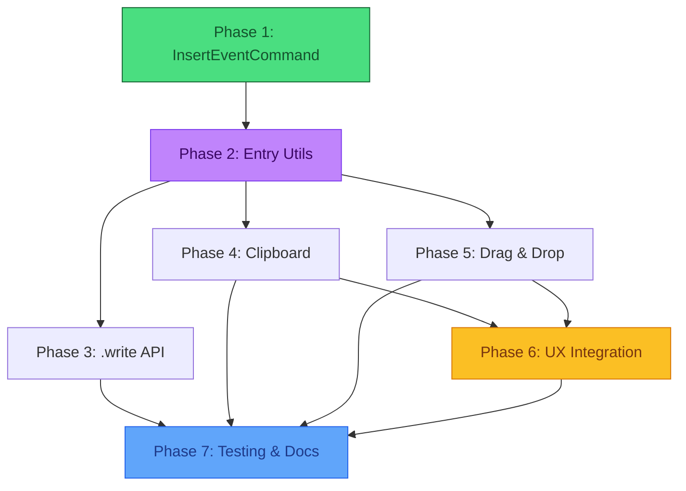

# Implementation Plan: Unified Event Operations

> **Feature Family**: InsertEventCommand, .write() API, Clipboard, Drag-and-Drop  
> **Goal**: Single architecture for all event insertion/movement operations independent of input source.  
> **RFC**: [InsertEventCommand and Unified Event Operations](./rfc-insert-event-command.md)

---

## Architecture Overview

**Three-Layer Architecture** handles all event operations:

| Layer | Location | Responsibility |
|-------|----------|----------------|
| **API Factories** | `src/hooks/api/` | Translate user intent, validation, feedback |
| **Entry Utilities** | `src/utils/entry/` | Pure functions: split/tie events, enforce tuplet atomicity |
| **Commands** | `src/commands/` | Atomic, undoable primitives (`InsertEventCommand`, `DeleteEventCommand`) |

> [!NOTE]
> This extends the **existing** `src/utils/entry/` directory rather than creating a separate module. The existing `eventInserter.ts` already handles insertion planning—we extend it for paste scenarios.

**Related ADRs:**
- [ADR-003: Transaction Batching](../adr/003-transaction-batching.md) — Paste uses `BatchCommand` for atomic undo
- [ADR-004: API Factory Pattern](../adr/004-api-factory-pattern.md) — `.paste()` lives in `src/hooks/api/clipboard.ts`
- [ADR-011: Structured API Feedback](../adr/011-structured-api-feedback.md) — Errors return `{ ok: false, code: 'INVALID_CLIPBOARD' }`

---

## Decisions

| Topic | Decision |
|-------|----------|
| Undo grouping | Use existing `BatchCommand` for single undo macro |
| Paste mode | Default: insert-and-shift; overwrite mode available |
| Clipboard | System clipboard (JSON) for cross-instance paste |
| ID generation | Use `eventId()` from `src/utils/id.ts` |

---

## Phased Implementation

### Phase 1: Foundation (Primitives) 🚧 CURRENT

**Goal**: Fix tuplet preservation bug; enable atomic insertion of complete events.

| Task | Status |
|------|--------|
| Create `InsertEventCommand` (accepts full `ScoreEvent`) | ✅ |
| Create unit tests for `InsertEventCommand` | ✅ |
| Update `entry.ts` overflow to use `InsertEventCommand` | ✅ |
| Verify tuplet properties survive overflow | ✅ |

> [!TIP]
> `DeleteEventCommand` already exists in `src/commands/DeleteEventCommand.ts`.

---

### Phase 2: Entry Utilities Extension

**Goal**: Extend existing `src/utils/entry/` with paste-specific logic.

**Existing files to leverage**:
- `eventInserter.ts` — already has `planInsertion()`, `computeStartQuant()`, `planOverflow()`
- `notePayload.ts` — already has `createNotePayload()`
- `pitchResolver.ts` — pitch resolution logic

**New files to add**:

```
src/utils/entry/
├── eventInserter.ts      # EXISTS - extend with paste planning
├── notePayload.ts        # EXISTS - reuse for event creation
├── splitEvent.ts         # NEW - single event → tied pair at bar line
├── tupletGuard.ts        # NEW - detect tuplet groups, calc atomic shifts
├── normalize.ts          # NEW - dispatcher: input type detection
└── types.ts              # NEW - NormalizedPasteData, PastePlan interfaces
```

**New formats directory** (for ABC parsing, future MusicXML):

```
src/formats/
├── abc/
│   ├── parse.ts          # NEW - "C4 D4 E4" → ScoreEvent[]
│   └── generate.ts       # MOVE from src/exporters/abcExporter.ts
├── musicxml/             # FUTURE
│   ├── parse.ts
│   └── generate.ts
└── json/
    └── generate.ts       # MOVE from src/exporters/jsonExporter.ts
```

| Task | Status |
|------|--------|
| Create `src/utils/entry/types.ts` — interfaces | ⬜ |
| Create `src/utils/entry/splitEvent.ts` — bar line splitting | ⬜ |
| Create `src/utils/entry/tupletGuard.ts` — atomicity | ⬜ |
| Create `src/utils/entry/normalize.ts` — input dispatcher | ⬜ |
| Extend `eventInserter.ts` with paste planning | ⬜ |
| Create `src/formats/abc/parse.ts` — ABC → events | ⬜ |
| Migrate `abcExporter.ts` → `src/formats/abc/generate.ts` | ⬜ |

---

### Phase 3: .write() API (#167)

**Goal**: Scriptable insertion engine for programmatic score building.

**Location**: `src/hooks/api/write.ts` (new API factory per ADR-004)

| Task | Status |
|------|--------|
| Create `write.ts` factory | ⬜ |
| Implement `.write(input, options)` using entry utilities | ⬜ |
| Support ABC notation input via `src/formats/abc/parse.ts` | ⬜ |
| Support object input via existing `notePayload.ts` | ⬜ |
| Return `this` for fluent chaining | ⬜ |

---

### Phase 4: Clipboard Operations (#36)

**Goal**: User-facing Copy/Cut/Paste with system clipboard.

**File Structure** (separated by concern):

```
src/formats/clipboard/
├── serialize.ts          # Selection → NormalizedPasteData
└── deserialize.ts        # Validate + parse clipboard JSON

src/services/
└── clipboardService.ts   # Browser Clipboard API wrapper (shared across surfaces)

src/hooks/api/
└── clipboard.ts          # API factory: thin orchestrator
```

| Task | Status |
|------|--------|
| `src/formats/clipboard/serialize.ts` — selection to normalized data | ⬜ |
| `src/formats/clipboard/deserialize.ts` — validate schema, parse | ⬜ |
| `src/services/clipboardService.ts` — async read/write wrapper | ⬜ |
| `src/hooks/api/clipboard.ts` — API factory with copy/cut/paste | ⬜ |
| Wrap paste in `BatchCommand` for atomic undo | ⬜ |

---

### Phase 5: Drag-and-Drop (#37)

**Goal**: Visual reordering via mouse drag.

**File Structure**:

```
src/hooks/interaction/
├── useDragToSelect.ts    # EXISTS - extend with drag-to-move logic
└── useDragToMove.ts      # NEW - dedicated drag-move hook

src/components/Canvas/
└── GhostPreview.tsx      # EXISTS - extend for drag preview
```

| Task | Status |
|------|--------|
| Evaluate extending `useDragToSelect.ts` vs new `useDragToMove.ts` | ⬜ |
| Extend `GhostPreview.tsx` for drag visualization | ⬜ |
| Drag pickup: serialize via `formats/clipboard/serialize.ts` | ⬜ |
| Drop: delete originals + paste at target | ⬜ |
| Cross-measure drop handling | ⬜ |

---

### Phase 6: UX Integration

**Goal**: Toolbar buttons, keyboard shortcuts, and visual feedback.

**File Structure**:

```
src/hooks/handlers/
└── handleClipboard.ts    # NEW - keyboard shortcut handler

src/components/Toolbar/
├── ClipboardControls.tsx # NEW - Copy/Cut/Paste buttons
└── Toolbar.tsx           # MODIFY - add ClipboardControls
```

| Task | Status |
|------|--------|
| `handleClipboard.ts` — Ctrl/Cmd+C, X, V handler | ⬜ |
| `ClipboardControls.tsx` — toolbar buttons | ⬜ |
| Disabled states when no selection / empty clipboard | ⬜ |
| Wire into `useKeyboardShortcuts` | ⬜ |
| Visual feedback: paste preview | ⬜ |
| Error toast via ADR-011 feedback pattern | ⬜ |

---

### Phase 7: Testing & Documentation

**Goal**: Comprehensive test coverage and user-facing documentation.

**File Structure** (flat, matching existing patterns):

```
src/__tests__/
├── InsertEventCommand.test.ts         # NEW - command unit tests
├── splitEvent.test.ts                 # NEW - entry utility
├── tupletGuard.test.ts                # NEW - entry utility
├── abc.parse.test.ts                  # NEW - format parsing
├── clipboard.serialize.test.ts        # NEW - format serialization
└── ScoreAPI.clipboard.test.tsx        # NEW - integration

docs/
├── COOKBOOK.md                        # MODIFY - add clipboard recipes
└── API.md                             # MODIFY - document .write(), .paste()
```

| Task | Status |
|------|--------|
| Unit tests for `InsertEventCommand` | ⬜ |
| Unit tests for `entry/` utilities (splitEvent, tupletGuard) | ⬜ |
| Unit tests for `formats/` (abc parse, clipboard serialize) | ⬜ |
| Integration tests: paste across measures, tuplet handling | ⬜ |
| Cookbook examples for `.write()` and `.paste()` | ⬜ |
| Update API reference docs | ⬜ |

---

## Dependency Graph



---

## Key Considerations

| Topic | Requirement |
|-------|-------------|
| **Tuplet integrity** | Entry utilities treat tuplet groups as indivisible |
| **Ties** | Splitting note across bar line creates two events with `tied: true` |
| **Validation** | `.write()` partial input needs validation before becoming `ScoreEvent` |
| **IDs** | Inserted events get fresh IDs via `eventId()` from `src/utils/id.ts` |
| **Accessibility** | Toolbar buttons need proper ARIA labels and keyboard focus |
| **Error handling** | Invalid clipboard data returns `{ ok: false, code: 'INVALID_CLIPBOARD' }` |

---

## Implementation Notes

Strategic guidance drawn from [CODING_PATTERNS.md](../CODING_PATTERNS.md).

### Phase 1: InsertEventCommand

**Pattern**: Command/Dispatch (§1)

```typescript
// src/commands/InsertEventCommand.ts
export class InsertEventCommand implements Command {
  public readonly type = 'INSERT_EVENT';
  
  constructor(
    private measureIndex: number,
    private event: ScoreEvent,       // Complete object, not individual props
    private insertIndex?: number,
    private staffIndex: number = 0
  ) {}

  execute(score: Score): Score { /* ... */ }
  undo(score: Score): Score { /* ... */ }
}
```

- Use `structuredClone()` to deep-copy event on insert
- Use existing `updateMeasure()` helper from `commandHelpers.ts`
- `undo()` filters by `event.id`—no need to track insert index

---

### Phase 2: Entry Utilities Extension

**Pattern**: Service Layer (§1) — pure functions, no React, no state

**Reuse existing code**:
- `eventInserter.ts` already has `planInsertion()` — extend for paste
- `notePayload.ts` has `createNotePayload()` — reuse for object→event
- `validation.ts` has `parseDuration()` — reuse for input normalization

**New files** (single responsibility, ~50-80 lines each):

| File | Responsibility |
|------|----------------|
| `types.ts` | `NormalizedPasteData`, `PastePlan` interfaces |
| `splitEvent.ts` | Split event at bar line → tied pair |
| `tupletGuard.ts` | Detect tuplet groups, calc atomic shifts |
| `normalize.ts` | Detect input type, delegate to parsers |

**ABC parsing in formats/**:

```typescript
// src/formats/abc/parse.ts
import { Note } from 'tonal';
import { createNotePayload } from '@/utils/entry/notePayload';
import { parseDuration } from '@/utils/validation';

export function parseAbcToEvents(abc: string): ScoreEvent[] {
  // Parse ABC notation, delegate to existing utilities
}
```

**Extend eventInserter.ts** (don't duplicate):

```typescript
// Add to existing eventInserter.ts
export function planPaste(
  ctx: InsertionContext,
  events: ScoreEvent[]
): InsertionPlan[] {
  // Reuse existing computeStartQuant, planInsertion, planOverflow
}
```

**Use existing utilities**:
- `getNoteDuration()` from `core.ts` for quant math
- `calculateTotalQuants()` for measure capacity checks
- `eventId()`, `noteId()` from `id.ts` for new entities

---

### Phase 3–4: API Factories

**Pattern**: API Factory (§1, ADR-004)

**Clipboard: separation of concerns**:

```
src/formats/clipboard/           # Format operations (like abc/, json/)
├── serialize.ts                 # ~80 lines - selection → NormalizedPasteData
└── deserialize.ts               # ~60 lines - validation + parse

src/services/clipboardService.ts # ~40 lines - browser API (shared service)

src/hooks/api/clipboard.ts       # ~50 lines - API factory (thin)
```

**Thin API factory** (delegates to formats/ and services/):

```typescript
// clipboard.ts - thin orchestrator
import { serializeSelection } from '@/formats/clipboard/serialize';
import { deserializeClipboard, isValidClipboardData } from '@/formats/clipboard/deserialize';
import { writeToClipboard, readFromClipboard } from '@/services/clipboardService';

export const createClipboardMethods = (ctx: APIContext) => ({
  async copy(): Promise<MusicEditorAPI> {
    const data = serializeSelection(ctx.selectionRef.current, ctx.scoreRef.current);
    await writeToClipboard(data);
    return this;
  },
  
  async paste(options?: PasteOptions): Promise<MusicEditorAPI> {
    const raw = await readFromClipboard();
    if (!isValidClipboardData(raw)) {
      ctx.setResult({ ok: false, code: 'INVALID_CLIPBOARD', ... });
      return this;
    }
    const data = deserializeClipboard(raw);
    // ... use placement utilities
    return this;
  }
});
```

**Transaction wrapping** (per ADR-003):
```typescript
ctx.history.beginTransaction();
try {
  commands.forEach(cmd => ctx.dispatch(cmd));
  ctx.history.commitTransaction();
} catch (e) {
  ctx.history.rollbackTransaction();
}
```

---

### Phase 6: Keyboard Shortcuts

**Pattern**: Handler Modules (`hooks/handlers/`)

Create `handleClipboard.ts` alongside existing handlers:
```typescript
// src/hooks/handlers/handleClipboard.ts
export const handleClipboard = (
  e: KeyboardEvent,
  api: MusicEditorAPI,
  hasSelection: boolean
): boolean => {
  const isMac = navigator.platform.includes('Mac');
  const modifier = isMac ? e.metaKey : e.ctrlKey;
  
  if (modifier && e.key === 'c') {
    api.copy();
    return true;
  }
  // ... cut, paste
  return false;
};
```

Wire into `useKeyboardShortcuts` via existing pattern.

---

### Phase 7: Testing Strategy

**Pattern**: Shared Fixtures + Cookbook Tests (§6)

1. **Unit tests** for pure utilities:
   ```typescript
   // src/__tests__/eventPlacement.test.ts
   import { planPaste } from '@/utils/eventPlacement';
   
   test('splits event crossing bar line', () => {
     const score = createTestScore({ timeSignature: '4/4' });
     const data = { events: [/* quarter at beat 4.5 */] };
     const commands = planPaste(score, data, target);
     
     expect(commands).toHaveLength(2);  // Split into two
     expect(commands[0].event.tied).toBe(true);
   });
   ```

2. **Cookbook integration tests**:
   ```typescript
   // src/__tests__/ScoreAPI.cookbook.test.tsx
   test('Recipe: Copy and paste a chord', () => {
     const api = setupTestApi();
     api.select(1).addNote('C4').addNote('E4').addNote('G4');
     api.copy();
     api.jump(2).paste();
     
     expect(api.getScore().staves[0].measures[1].events).toHaveLength(1);
   });
   ```

3. **100% coverage policy** applies to new files

---

### TypeScript Conventions

Per §8 of CODING_PATTERNS:

- **No `any`** — use explicit types or `unknown` with guards
- **Explicit return types** on all exported functions
- **String unions** over enums:
  ```typescript
  type PasteMode = 'insert' | 'overwrite';
  ```
- **Discriminated unions** for complex state:
  ```typescript
  type PasteResult = 
    | { ok: true; insertedCount: number }
    | { ok: false; code: string; message: string };
  ```
