# RFC: InsertEventCommand and Unified Event Operations

> **Status**: Draft  
> **Author**: RiffScore Team  
> **Created**: 2026-01-02  
> **Updated**: 2026-01-02

## Related Issues

| Issue | Title | Relevance |
|-------|-------|-----------|
| [#161](https://github.com/joekotvas/RiffScore/issues/161) | Improve addNote API | Current work - insert mode, overflow |
| [#167](https://github.com/joekotvas/RiffScore/issues/167) | .write() API | Future - scriptable insertion engine |
| [#36](https://github.com/joekotvas/RiffScore/issues/36) | Copy, Paste, and Cut notes | Future - clipboard operations |
| [#37](https://github.com/joekotvas/RiffScore/issues/37) | Drag notes horizontally to reorder | Future - drag-and-drop |
| [#49](https://github.com/joekotvas/RiffScore/issues/49) | Bug: Dragging multi-note selection only moves targeted event | Related bug - event moving |
| [#51](https://github.com/joekotvas/RiffScore/issues/51) | Bug: Dragging notes past staff range allows invalid pitches | Related bug - event validation |
| [#131](https://github.com/joekotvas/RiffScore/issues/131) | Tuplet bracket angle should match beam angle | Related - tuplet handling |

---

## Abstract

This RFC proposes a **three-layer architecture** for event manipulation that separates concerns cleanly:

1. **Input Surfaces** — API, Toolbar, Keyboard/Mouse translate user intent
2. **Placement Utilities** — Pure functions handle splitting, overflow, tuplet atomicity
3. **Command Layer** — Atomic `InsertEventCommand` accepts complete `ScoreEvent` objects

This architecture enables robust event insertion, moving, clipboard operations, and drag-and-drop while making each layer independently testable.

> [!NOTE]
> **Terminology**: "Placement Utilities" lives in the Services/Utils layer of [ARCHITECTURE.md](../ARCHITECTURE.md). This is distinct from the "Orchestration Layer" which refers to React hook coordination (`useScoreLogic`).

---

## Problem Statement

### Current Bug: Property Loss During Overflow

When events overflow to the next measure in insert mode, they lose properties like `tuplet`:

```typescript
// Current: Reconstructs event from individual properties → LOSES tuplet, etc.
dispatch(new AddEventCommand(nextMeasure, isRest, notes[0], duration, ...));
```

### Broader Challenge: Complex Paste Scenarios

Future features face scenarios where simple property-by-property reconstruction fails:

| Scenario | Challenge |
|----------|-----------|
| Paste into smaller measure | 4/4 content → 3/4 target |
| Cross-measure content | 2 measures copied, paste at beat 3 |
| Grand staff paste | Treble+bass copied together |
| Tuplet boundary | Paste lands mid-tuplet in target |

---

## Architecture

### Three Layers, One Flow


### Layer Responsibilities

| Layer | Location | Owns | Does NOT Know About |
|-------|----------|------|---------------------|
| **Surfaces** | `src/hooks/api/` | User intent, validation | Measure capacity, splits |
| **Entry Utilities** | `src/utils/entry/` | Splitting, overflow, tuplet groups | Undo/redo, React |
| **Commands** | `src/commands/` | Atomic score mutation + undo | Where event came from |

### Data Flow: Paste Operation

```mermaid
flowchart LR
    Clipboard["📋 System Clipboard"] --> JSON["JSON string"]
    JSON --> Data["NormalizedPasteData"]
    Data --> Cmds["InsertEventCommand[]"]
    Cmds --> Batch["BatchCommand"]
    Batch --> Score[("Score")]
```



---

## Command Layer: InsertEventCommand

### Design Principles

1. **Dumb** — No knowledge of quants, measure capacity, or tuplets
2. **Complete** — Accepts full `ScoreEvent` with all properties preserved
3. **Atomic** — Single insert, trivial undo

### Implementation

```typescript
// src/commands/InsertEventCommand.ts
export class InsertEventCommand implements Command {
  public readonly type = 'INSERT_EVENT';

  constructor(
    private measureIndex: number,
    private event: ScoreEvent,      // Complete event object
    private insertIndex?: number,   // undefined = append
    private staffIndex: number = 0
  ) {}

  execute(score: Score): Score {
    return updateMeasure(score, this.staffIndex, this.measureIndex, (measure) => {
      const newEvents = [...measure.events];
      const clonedEvent = structuredClone(this.event);

      if (this.insertIndex !== undefined && this.insertIndex >= 0) {
        newEvents.splice(this.insertIndex, 0, clonedEvent);
      } else {
        newEvents.push(clonedEvent);
      }

      measure.events = newEvents;
      return true;
    });
  }

  undo(score: Score): Score {
    return updateMeasure(score, this.staffIndex, this.measureIndex, (measure) => {
      measure.events = measure.events.filter(e => e.id !== this.event.id);
      return true;
    });
  }
}
```

> [!IMPORTANT]
> The command uses `structuredClone()` to ensure the stored event is independent of the input, preventing accidental mutation.

---

## Placement Utilities

### Directory Structure

```
src/utils/eventPlacement/
├── normalize.ts      # Input → ScoreEvent[] conversion
├── planPaste.ts      # Calculate measure spans, splits, overflow
├── generateCmds.ts   # Plan → InsertEventCommand[]
├── types.ts          # NormalizedPasteData, PastePlan interfaces
└── index.ts
```

### Key Type: NormalizedPasteData

Events stored relative to **paste origin**, not measure boundaries:

```typescript
interface NormalizedPasteData {
  /** Events positioned relative to logical origin (quant 0 = paste point) */
  events: Array<{
    offsetQuants: number;  // Position relative to paste origin
    event: ScoreEvent;     // Complete event with all properties
  }>;
  
  /** Total duration of content in quants */
  totalQuants: number;
  
  /** Hint for orchestrator to handle atomicity */
  containsTuplets: boolean;
  
  /** For multi-staff paste (grand staff copy/paste) */
  staves?: Array<{
    staffOffset: number;
    events: NormalizedEvent[];
  }>;
}
```

### Orchestration Flow

```typescript
// Simplified flow - actual implementation will handle edge cases
function executeInsertion(
  score: Score,
  data: NormalizedPasteData,
  target: InsertionTarget,
  dispatch: (cmd: Command) => void
): void {
  // 1. Plan placement (pure function, no side effects)
  const plan = planPaste(score, data, target);
  
  // 2. Enforce tuplet atomicity
  //    If a tuplet group would be split by a bar line, move entire group
  for (const group of plan.tupletGroups) {
    if (group.wouldSplitAcrossBarLine) {
      group.shiftToNextMeasure();
    }
  }
  
  // 3. Handle measure overflow with tie creation
  for (const placement of plan.placements) {
    if (placement.crossesBarLine) {
      // Create tied notes across measures
      const [firstHalf, secondHalf] = splitEventWithTie(placement.event, placement.splitPoint);
      dispatch(new InsertEventCommand(placement.measureIndex, firstHalf));
      dispatch(new InsertEventCommand(placement.measureIndex + 1, secondHalf));
    } else {
      dispatch(new InsertEventCommand(
        placement.measureIndex,
        placement.event,
        placement.insertIndex,
        placement.staffIndex
      ));
    }
  }
}
```

---

## Design Decisions

### Why Splitting Happens in Placement Utilities, Not Commands

| Concern | Why NOT in Command |
|---------|-------------------|
| **Splitting** | Needs global context (time signature, measure capacity) |
| **Tie creation** | Creates multiple new events → multiple commands |
| **Tuplet atomicity** | Must see whole tuplet group to decide where it lands |
| **Undo granularity** | Each split piece = separate undoable unit |

Commands must be context-free. Splitting requires knowing what surrounds the target location.

### Why Commands Accept Complete ScoreEvent Objects

| Alternative | Problem |
|-------------|---------|
| Pass individual properties | Property lists grow; easy to miss new properties like `tuplet` |
| Partial objects + merge | Merge logic duplicated, edge cases multiply |
| **Complete event (chosen)** | Single source of truth, all properties preserved |

---

## Phased Implementation

### Phase 1: Foundation (Immediate) 🚧

Fix the tuplet preservation bug with minimal changes:

- [ ] Create `InsertEventCommand.ts` in `src/commands/`
- [ ] Export from `src/commands/index.ts`
- [ ] Update `entry.ts` overflow logic to use `InsertEventCommand`
- [ ] Test: Verify tuplet properties survive overflow

### Phase 2: Orchestration Layer

Build shared utilities for any insertion source:

- [ ] Create `src/utils/orchestration/` directory
- [ ] Implement `normalize.ts` — convert `WritePayload` → `ScoreEvent[]`
- [ ] Implement `planPaste.ts` — calculate measure fits, splits
- [ ] Implement `generateCmds.ts` — plan → command list

### Phase 3: .write() API (#167)

Scriptable insertion engine:

- [ ] Implement `.write(input, options)` using orchestration layer
- [ ] Consider whether `.addNote()` / `.addRest()` should wrap `.write()` or remain parallel

### Phase 4: Clipboard Operations (#36)

Copy/Cut/Paste:

- [ ] Implement selection serialization
- [ ] Create clipboard state management
- [ ] Implement `.paste()` API method
- [ ] Wire up keyboard shortcuts (Ctrl+C, Ctrl+V)

### Phase 5: Drag-and-Drop (#37)

Visual reordering:

- [ ] Drag handlers serialize as "cut" operation
- [ ] Drop handlers use orchestration layer for placement
- [ ] Handle cross-measure drops

---

## Files to Create/Modify

### Phase 1 (Immediate)

| File | Action |
|------|--------|
| `src/commands/InsertEventCommand.ts` | CREATE |
| `src/commands/index.ts` | MODIFY — export InsertEventCommand |
| `src/hooks/api/entry.ts` | MODIFY — use InsertEventCommand for overflow |

### Phase 2+ (Future)

| File | Action |
|------|--------|
| `src/utils/orchestration/types.ts` | CREATE |
| `src/utils/orchestration/normalize.ts` | CREATE |
| `src/utils/orchestration/planPaste.ts` | CREATE |
| `src/utils/orchestration/generateCmds.ts` | CREATE |
| `src/hooks/api/clipboard.ts` | CREATE |

---

## Summary

1. **InsertEventCommand** — Atomic command accepting complete `ScoreEvent`, no splitting knowledge
2. **Orchestration layer** — Pure functions for splitting, overflow, tuplet handling
3. **All surfaces share orchestration** — API, Toolbar, Keyboard/Mouse all call same utils
4. **Immediate fix** — Use `InsertEventCommand` for overflow to preserve tuplet properties
5. **Future-proof** — Same architecture scales to clipboard and drag-and-drop

---

## Decisions

| Question | Decision |
|----------|----------|
| **Undo grouping** | Batch multi-event operations into a single undo macro |
| **Paste conflict resolution** | Default to insert-and-shift; overwrite mode available as option |
| **Clipboard storage** | Use system clipboard (JSON serialized) to enable cross-instance paste |
